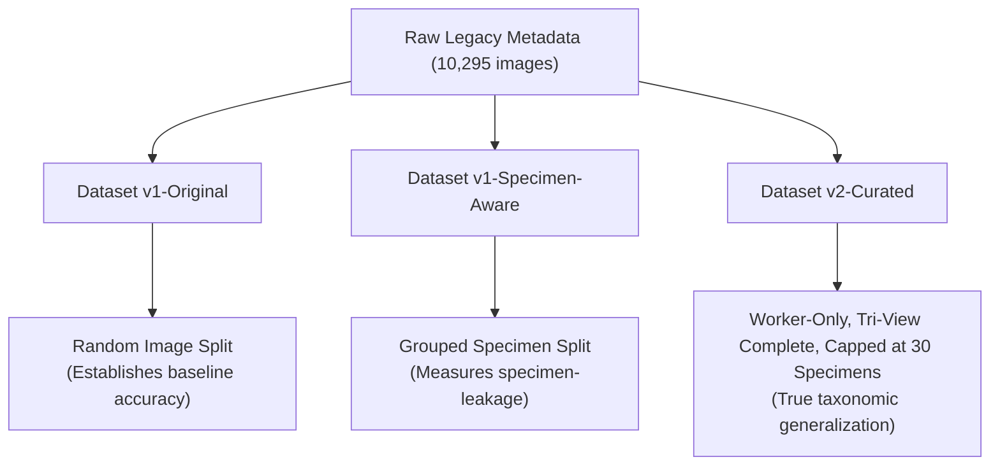

# KeyAgent-Ant: Dataset v2 Expansion & Evaluation Strategy

This strategy document outlines the evolutionary roadmap for KeyAgent-Ant's image data, transitioning from legacy unstructured image sets to a highly curated, balanced, specimen-aware research dataset.

---

## Dataset Classifications

We define three distinct configurations of the KeyAgent-Ant dataset, each designed to answer a specific scientific question in our research pipeline.

### 1. Dataset v1-Original
* **Scope:** 97 species, 10,211 valid images (derived from 10,295 raw legacy metadata rows after filtering 84 malformed records).
* **Split Type:** Image-level random split (e.g., standard 80/10/10).
* **Caste Composition:** Mixed (workers, queens, and males).
* **Research Purpose:** Establishing a baseline replication of the original AntID Tutor model. It will exhibit exceptionally high apparent accuracy due to validation leakage and memorization of background/specimen tokens.

### 2. Dataset v1-Specimen-Aware
* **Scope:** Same 97 species, 10,211 valid images (identical to v1-original).
* **Split Type:** Specimen-aware split grouped strictly by `catalog_number`.
* **Caste Composition:** Mixed.
* **Research Purpose:** Testing the **Specimen-Leakage Hypothesis**. By comparing the validation accuracy of `v1-original` against `v1-specimen-aware` under the identical architecture, we can mathematically isolate and quantify the "leakage generalization gap" caused by random splits.

### 3. Dataset v2-Curated (The Recommended Design)
* **Scope:** 97 species, exactly **2,331 unique physical specimens** yielding **6,993 images** in our realized production build (projected at 2,341 specimens / 7,023 images during early simulation).
* **Split Type:** Strict specimen-aware split.
* **Caste Composition:** **Worker caste only** (removes 1,852 queen and male images).
* **View Consistency:** Strict tri-view complete (exactly 1 dorsal, 1 head, and 1 profile image per physical specimen). Discards 65 partial specimens.
* **Balancing Rule:** Capped at a maximum of **30 complete tri-view specimens (90 images)** per species. Highly overrepresented dominant classes like `camponotus_maculatus` and `pheidole_megacephala` are downsampled.
* **Exclusion Policy:** **No species are excluded.** The lowest specimen count in the worker-only subset is 12 (`mystrium_mirror` and `technomyrmex_vitiensis`), which easily supports a specimen-aware T/V/T partition.
* **Research Purpose:** This is the core dataset for training KeyAgent-Ant's comparative and agentic taxonomic identification engines. It resolves morphological caste noise, eliminates incomplete metadata, and reduces class imbalance from 12.44:1 to **2.50:1**, ensuring robust and fair taxonomic evaluation.

---

## Estimated Specimen Expansion Requirements

To evaluate how much physical-specimen expansion is required to support various training scales, we project requirements across three target thresholds (10, 25, and 50 complete tri-view specimens per species).

### Target 10: Low-Volume Specimen-Aware Standard
* **Requirement:** Minimum 10 complete tri-view specimens per species.
* **Audit Results:** **No expansion required.**
* **Strategic Status:** 100% of our 97 species already possess at least 18 complete tri-view specimens. We can execute this standard today with zero additional downloads.

---

### Target 25: Balanced Medium-Scale Standard
* **Requirement:** Minimum 25 complete tri-view specimens per species.
* **Audit Results:**
  * **No Expansion Required (Already >= 25):** 74 species
  * **Moderate Expansion Required (Needs 1-5 specimens):** 21 species
  * **Major Expansion Required (Needs > 5 specimens):** 2 species
* **Total New Specimens Needed:** Exactly **47 unique physical specimens** (representing 141 images across 23 species) to achieve a perfectly balanced dataset where every single one of the 97 species has *exactly* 25 complete tri-view specimens.

#### Moderate & Major Expansion Table (Target 25)
| # | Species Binomial | Current Complete Tri-Views | Additional Specimens Needed | Strategic Status |
| :-: | :--- | :---: | :---: | :--- |
| 1 | `camponotus_christi` | 18 | **7** | Major Expansion |
| 2 | `camponotus_rufoglaucus` | 19 | **6** | Major Expansion |
| 3 | `azteca_alfari` | 21 | **4** | Moderate Expansion |
| 4 | `camponotus_hova` | 21 | **4** | Moderate Expansion |
| 5 | `pheidole_biconstricta` | 21 | **4** | Moderate Expansion |
| 6 | `zasphinctus_imbecilis` | 21 | **4** | Moderate Expansion |
| 7 | `camponotus_bonariensis` | 22 | **3** | Moderate Expansion |
| 8 | `camponotus_planus` | 22 | **3** | Moderate Expansion |
| 9 | `monomorium_subopacum` | 22 | **3** | Moderate Expansion |
| 10 | `technomyrmex_vitiensis` | 22 | **3** | Moderate Expansion |
| 11 | `carebara_diversa` | 23 | **2** | Moderate Expansion |
| 12 | `iridomyrmex_anceps` | 23 | **2** | Moderate Expansion |
| 13 | `kalathomyrmex_emeryi` | 23 | **2** | Moderate Expansion |
| 14 | `mystrium_mirror` | 23 | **2** | Moderate Expansion |
| 15 | `nylanderia_madagascarensis` | 23 | **2** | Moderate Expansion |
| 16 | `pheidole_susannae` | 23 | **2** | Moderate Expansion |
| 17 | `polyrhachis_dives` | 23 | **2** | Moderate Expansion |
| 18 | `pseudomyrmex_gracilis` | 23 | **2** | Moderate Expansion |
| 19 | `colobopsis_vitrea` | 24 | **1** | Moderate Expansion |
| 20 | `crematogaster_gerstaeckeri` | 24 | **1** | Moderate Expansion |
| 21 | `eciton_burchellii` | 24 | **1** | Moderate Expansion |
| 22 | `monomorium_termitobium` | 24 | **1** | Moderate Expansion |
| 23 | `pheidole_caffra` | 24 | **1** | Moderate Expansion |

---

### Target 50: High-Volume Production Standard
* **Requirement:** Minimum 50 complete tri-view specimens per species.
* **Audit Results:**
  * **No Expansion Required (Already >= 50):** 9 species (`camponotus_maculatus`, `pheidole_megacephala`, `tetramorium_sericeiventre`, `hypoponera_punctatissima`, `dorylus_nigricans`, `solenopsis_geminata`, `diacamma_rugosum`, `pheidole_indica`, `tetramorium_simillimum`).
  * **Moderate Expansion Required (Needs 1-20 specimens):** 42 species
  * **Major Expansion Required (Needs 21-32 specimens):** 46 species
* **Total New Specimens Needed:** Exactly **1,947 unique physical specimens** (representing 5,841 images) across 88 species. This represents a massive engineering and curation effort.

> [!CAUTION]
> Reaching the Target 50 standard requires expanding the dataset by **56.1% in specimens** and downloading **5,841 new images**. This scale of download should **not** be pursued before establishing baseline evaluations, as it would severely delay early milestones and introduce unvetted geographic or taxonomic shifts from AntWeb.

---

## Core Strategic Questions & Final Recommendations

### A. Should KeyAgent-Ant focus primarily on genus or species classification?
KeyAgent-Ant must focus primarily on **species-level classification** as its ultimate target, but implement **hierarchical taxonomic classification** as a core architectural constraint.

* **Rationale:** Dichotomous identification keys resolve to the species level, which is where comparative agentic logic, morphologic trait description (e.g., "propodeal spines present"), and grounded explanations are scientifically valuable. 
* **Implementation:** The model should be trained with a hierarchical multi-head loss (predicting Subfamily, Genus, and Species simultaneously). This forces the shared feature extractor to learn genus-level structural representations, enabling the model to degrade gracefully. If a species prediction has low confidence, the agent can roll back to a highly confident genus prediction (e.g., "I am 98% confident this is a *Camponotus*, but let me analyze the species-level traits to distinguish between *C. maculatus* and *C. christi*").

### B. Is the current 97-species dataset sufficient for baseline reproduction?
**Yes, absolutely.** The current dataset of 10,295 images maps to 3,465 unique specimens, meaning every single species has at least 18 specimens (far above the split limit of 3). It is completely stable, locked, and fully capable of baseline reproduction and testing.

### C. Should additional data be downloaded before baseline reproduction?
**No. This would be a severe research anti-pattern.** 
Downloading more images before reproducing the baseline would violate scientific isolation. We must first establish the exact performance of the legacy pipeline under both standard splits (`v1-original`) and specimen-aware splits (`v1-specimen-aware`) to mathematically prove the **specimen-leakage hypothesis**. Only once this generalization gap is measured should we transition to a curated or expanded dataset.

### D. What is the strongest Dataset v2 design?
The strongest design is the **Dataset v2-Curated** design simulated in this audit:

| Design Dimension | Rule | Scientific Justification |
| :--- | :--- | :--- |
| **Caste Filter** | **Workers Only** | Eliminates the severe morphological noise of queens/males which violates taxonomic key criteria. |
| **Completeness** | **Strict Tri-View** | Ensures every physical specimen has exactly `{d, h, p}` views, matching tri-view fusion network designs. |
| **Balancing** | **Capped at 30 Specimens** | Caps overrepresented species. Slashes class imbalance from **12.44:1 to 2.50:1** while retaining **all 97 species**. |
| **Total Size** | **2,331 specimens (6,993 images)** | Compact, clean, and highly balanced; no species excluded. |

### E. What should the next implementation milestone be?
**Milestone: Specimen-Aware Evaluation and Leakage Validation.**

1. **Step 1:** Modify the existing splitting code to ingest the legacy CSV and catalog numbers, partitioning specimens at the `catalog_number` level to generate a `Dataset v1-specimen-aware` partition.
2. **Step 2:** Train a standard image-level CNN/ViT baseline on `Dataset v1-original` (image-split) and compare it directly to `Dataset v1-specimen-aware` (specimen-split).
3. **Step 3:** Quantify the true generalization gap. This mathematically validates our specimen-aware architecture and publishes a rigorous, scientifically isolated benchmark proving that standard image-level splits are highly overoptimistic.

---

## Risks & Limitations

1. **Specimen Numbering Anomalies:** A tiny subset of records on AntWeb might have missing or improperly formatted `catalog_number` entries. Our pipeline must flag and drop records where the catalog number is blank.
2. **Geographical/Metadata Domain Shifts:** If we expand species in the future, we must ensure they are sourced from similar biogeographical regions, as geographical variation (e.g., Madagascar vs. Neotropical specimens) can introduce domain shifts.
3. **Worker Identification Quality:** Standardizing to "workers only" relies on the accuracy of the legacy CSV's caste annotations. Any misannotated queens or males in the CSV will introduce noise into the worker-only partition. A metadata verification step should be implemented during pipeline initialization.
